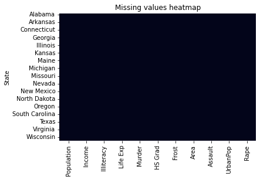

Preparatory Codes

install relevant packages


```python
!pip install geopandas
!pip install pyshp
!pip install pygeos

```

    Looking in indexes: https://pypi.org/simple, https://us-python.pkg.dev/colab-wheels/public/simple/
    Requirement already satisfied: geopandas in /usr/local/lib/python3.7/dist-packages (0.10.2)
    Requirement already satisfied: pandas>=0.25.0 in /usr/local/lib/python3.7/dist-packages (from geopandas) (1.3.5)
    Requirement already satisfied: fiona>=1.8 in /usr/local/lib/python3.7/dist-packages (from geopandas) (1.8.21)
    Requirement already satisfied: shapely>=1.6 in /usr/local/lib/python3.7/dist-packages (from geopandas) (1.8.2)
    Requirement already satisfied: pyproj>=2.2.0 in /usr/local/lib/python3.7/dist-packages (from geopandas) (3.2.1)
    Requirement already satisfied: click>=4.0 in /usr/local/lib/python3.7/dist-packages (from fiona>=1.8->geopandas) (7.1.2)
    Requirement already satisfied: munch in /usr/local/lib/python3.7/dist-packages (from fiona>=1.8->geopandas) (2.5.0)
    Requirement already satisfied: click-plugins>=1.0 in /usr/local/lib/python3.7/dist-packages (from fiona>=1.8->geopandas) (1.1.1)
    Requirement already satisfied: cligj>=0.5 in /usr/local/lib/python3.7/dist-packages (from fiona>=1.8->geopandas) (0.7.2)
    Requirement already satisfied: attrs>=17 in /usr/local/lib/python3.7/dist-packages (from fiona>=1.8->geopandas) (21.4.0)
    Requirement already satisfied: certifi in /usr/local/lib/python3.7/dist-packages (from fiona>=1.8->geopandas) (2022.5.18.1)
    Requirement already satisfied: six>=1.7 in /usr/local/lib/python3.7/dist-packages (from fiona>=1.8->geopandas) (1.15.0)
    Requirement already satisfied: setuptools in /usr/local/lib/python3.7/dist-packages (from fiona>=1.8->geopandas) (57.4.0)
    Requirement already satisfied: numpy>=1.17.3 in /usr/local/lib/python3.7/dist-packages (from pandas>=0.25.0->geopandas) (1.21.6)
    Requirement already satisfied: pytz>=2017.3 in /usr/local/lib/python3.7/dist-packages (from pandas>=0.25.0->geopandas) (2022.1)
    Requirement already satisfied: python-dateutil>=2.7.3 in /usr/local/lib/python3.7/dist-packages (from pandas>=0.25.0->geopandas) (2.8.2)
    Looking in indexes: https://pypi.org/simple, https://us-python.pkg.dev/colab-wheels/public/simple/
    Requirement already satisfied: pyshp in /usr/local/lib/python3.7/dist-packages (2.3.0)
    Looking in indexes: https://pypi.org/simple, https://us-python.pkg.dev/colab-wheels/public/simple/
    Requirement already satisfied: pygeos in /usr/local/lib/python3.7/dist-packages (0.12.0)
    Requirement already satisfied: numpy>=1.13 in /usr/local/lib/python3.7/dist-packages (from pygeos) (1.21.6)
    File ‘colab_pdf.py’ already there; not retrieving.
    
    


```python
from zipfile import ZipFile
import zipfile
from io import BytesIO
import pandas as pd
import numpy as np
import seaborn as sns
from google.colab import drive
import os
from google.colab import data_table
from sklearn.pipeline import Pipeline
from sklearn.preprocessing import scale
from sklearn.preprocessing import StandardScaler
from sklearn.model_selection import train_test_split
import matplotlib.pyplot as plt
from sklearn.cluster import KMeans
from sklearn.decomposition import PCA
from matplotlib import pyplot as plt
from sklearn.linear_model import Lasso
from sklearn.model_selection import GridSearchCV
import geopandas as gpd
import folium
import shapefile
import pyproj
import pygeos
from shapely.geometry import Point
from colab_pdf import colab_pdf
```


```python
def mount_drive(folder_path):
  drive.mount('/content/gdrive', force_remount = True)
  print(folder_path)
  os.chdir(folder_path)
  return os.listdir()
def get_zip(file_name):
  files=[file_name.open(file_names) for file_names in file_name.namelist()]
  return files.pop() if len(files) == 1 else files
def fix_data(data):
  if "CardNum " in data.columns:
    data.rename(columns={"CardNum ":"CardNum"},inplace=True)
  if "Depts" in data.columns:
    data.rename(columns={"Depts":"Dept"},inplace=True)


```


```python
#Input file path here.
mount_drive('/content/gdrive/MyDrive/Confidential')
```

    Mounted at /content/gdrive
    /content/gdrive/MyDrive/Confidential


Section 2 Question 2.1

Data import and manipulation


```python
#Import data
Arrest_data = zipfile.ZipFile('/content/gdrive/MyDrive/Application material/Applications/MOM/Project/US_Arrest_Data.zip')
Arrest_data=get_zip(Arrest_data)
Arrest_file_list=list()
#Arrest_var_list=list()

#extract dataframes for each csv file in zip file
for file in Arrest_data:
   name=str(file)
   name=name.split("<zipfile.ZipExtFile name='")[1].split("' mode='r' compress_type=deflate>")[0]
   name=name.replace("-","_")
   if "csv" in name:
      names=name.replace('.csv',"")
      globals()[f"{names}"]=pd.read_csv(file) 
      Arrest_file_list.append([f"{names}"])

###Data manipulation###
#label state column from USstatex77
USstatex77.rename(columns={'Unnamed: 0':'State'},inplace=True)
#Merge abbreviation with USstate77 for easier labelling
#USstatex77=pd.merge(USstatex77,USstateabb,left_index=True,right_index=True)
#USstatex77.drop(columns=['Unnamed: 0'],inplace=True)
#Merge all arrest data except murder to USstate
USArrestMerge=USArrest.drop(columns='Murder',axis=1)
USstatex77=pd.merge(USstatex77,USArrestMerge,left_on='State',right_on='Unnamed: 0')
USstatex77.drop(columns='Unnamed: 0',axis=1,inplace=True)
USstatex77.set_index('State',inplace=True)
```

Checking for missing data


```python
print(USstatex77.isnull().sum())
sns.heatmap(USstatex77.isnull(),cbar=False).set_title("Missing values heatmap")
```

    Population    0
    Income        0
    Illiteracy    0
    Life Exp      0
    Murder        0
    HS Grad       0
    Frost         0
    Area          0
    Assault       0
    UrbanPop      0
    Rape          0
    dtype: int64
    


    Text(0.5, 1.0, 'Missing values heatmap')


    

    


Visualizing correlation with scatterplot matrix and heatmap


```python
###standardize data###
scaler=StandardScaler()
USstate_std=scaler.fit_transform(USstatex77)
###transform numpy array back into dataframe
colname=list(USstatex77.columns)
USstate_std=pd.DataFrame(USstate_std,columns=colname)
USstate_std=pd.merge(USstate_std,USstateabb,left_index=True,right_index=True)
USstate_std.rename(columns={'x':'State'},inplace=True)
USstate_std.set_index('State',inplace=True)
USstate_std.drop('Unnamed: 0',axis=1,inplace=True)

###Scatterplot matrix
plot=sns.pairplot(USstate_std,palette='Set1')
#plot.savefig("Section_II_Q1_1.png") 
```


    

    


The following graph seeks to study the relation between the sum of square distance of points and number of clusters to determine the optimal number of clusters.While increasing the number of clusters would improve the fits, having too many parameters would result in overfitting. An elbow method is hence adopted when choosing the number of clusters where the additonal marginal utility (in terms of fit) would be equal or lower than the cost of adding another cluster(overfit).
It is hence determined that 5 would be an appropriate number of cluster.


```python
wcss = []
for i in range(1,10):
   model = KMeans(n_clusters = i, init = "k-means++")
   model.fit(USstate_std)
   wcss.append(model.inertia_)
plt.figure(figsize=(10,10))
plt.plot(range(1,10), wcss)
plt.xlabel('Number of clusters')
plt.ylabel('WCSS')
plt.show()
#n=5
```


    

    


In this step, we will use PCA as a means of dimension reduction.While PCA is usually used in supervised learning models, dimension reduction helps to focus our clustering model on a smaller selection of variables,at the cost of some loss of explained variance. It is determined from the graph below that 2 should be sufficient to explain a majority (a little above 60%) of the variance within the data.


```python
pca = PCA(4)
USstate_2 = pca.fit_transform(USstate_std)
plt.figure(figsize=(10,10))
var = np.round(pca.explained_variance_ratio_*100, decimals = 1)
lbls = [str(x) for x in range(1,len(var)+1)]
plt.bar(x=range(1,len(var)+1), height = var, tick_label = lbls)
plt.xlabel('Principal Components')
plt.ylabel('Percentage of explained variance')
plt.show()
```


    

    


```python
pca = PCA(2)
USstate_main = pca.fit_transform(USstate_std)
model = KMeans(n_clusters = 5, init = "k-means++")
label = model.fit_predict(USstate_main)
#plot figure according to fitted clusters for each state
plt.figure(figsize=(10,10))
uniq = np.unique(label)
for i in uniq:
   ax=plt.scatter(USstate_main[label == i , 0] , USstate_main[label == i , 1] , label = i)
plt.xlabel('1st Principal Component')
plt.ylabel('2nd Principal Component')
plt.legend()

#transform x,y coordinate data to dataframe
USstate_coord=pd.DataFrame(USstate_main,columns=['X','Y'])
#Produce dataframe showing states cluster
USstate_cluster=pd.DataFrame(label,columns=['label'])
USstate_cluster=pd.merge(USstate_cluster,USstateabb,left_index=True,right_index=True)
USstate_cluster.drop(columns=['Unnamed: 0'],axis=1,inplace=True)
USstate_cluster.rename(columns={'x':'State'},inplace=True)
USstate_cluster=pd.merge(USstate_cluster,USstate_coord,left_index=True,right_index=True)

USstate_cluster.set_index('State',inplace=True)
USstate_cluster.sort_values(by='label')
#label points accordingly
for index,row in USstate_cluster.iterrows():
  plt.annotate(str(index),(row['X'],row['Y']),textcoords="offset points",xytext=(0,5),ha='center')

#show plot 

fig1 = plt.gcf()

fig1.savefig('cluster.png', dpi=100)

plt.show()

```


    

    


Further study: Are there geographical relations for clustered regions?
As clustering is a form of unsupervised learning. I tried to study if there was a geographical relation between the states within each cluster.It is worth noting that the variables relating to the region which states belong to were not utilized (e.g. statearea,stateregion).A choropleth was made to study that relation (
Q2.1_MOM_choropleth).
It seems from the map that there is a relation between the region which a state belong to and the cluster which they were characterized by.


```python
##part II : Get shapefile of regions
Regionshp = gpd.read_file('https://www.weather.gov/source/gis/Shapefiles/County/s_11au16.zip')
Regionshp.geometry=Regionshp.geometry.to_crs(epsg='4326')

Regionshp=pd.DataFrame(Regionshp)
Regionshp=pd.merge(Regionshp,USstate_cluster['label'],right_index=True,left_on='STATE',how='right')
Regionshp=gpd.GeoDataFrame(Regionshp,geometry='geometry',crs='EPSG:4326')

```


```python
US_coord = [38.807160,-101.682592]
m = folium.Map(location=US_coord, zoom_start=10)
folium.Choropleth(geo_data=Regionshp,name='geometry',data=Regionshp,columns=['STATE', 'label'], key_on='feature.properties.STATE', fill_color='Set1', fill_opacity=0.75, line_opacity=0.5, legend_name='Clustered Region').add_to(m)
display(m)
m.save("MOM.html")


```

Section 2 Question 2.2

Part I:Data preparation and  manipulation
Note: As n is small (n=50) it was decided that splitting the data into train and test sets might result in inaccurate measurements of the predictability of the model as the test set would be too small.Thus, no train-test split was done.


```python
#Import data
Arrest_data = zipfile.ZipFile('/content/gdrive/MyDrive/Application material/Applications/MOM/Project/US_Arrest_Data.zip')
Arrest_data=get_zip(Arrest_data)
Arrest_file_list=list()
#Arrest_var_list=list()

#extract dataframes for each csv file in zip file
for file in Arrest_data:
   name=str(file)
   name=name.split("<zipfile.ZipExtFile name='")[1].split("' mode='r' compress_type=deflate>")[0]
   name=name.replace("-","_")
   if "csv" in name:
      names=name.replace('.csv',"")
      globals()[f"{names}"]=pd.read_csv(file) 
      Arrest_file_list.append([f"{names}"])

##Create Dataframe of data
US_Q2_1=pd.DataFrame(USstatex77)
US_Q2_1.rename(columns={'Unnamed: 0':'State'},inplace=True)

###Process other dataframes

##US arrest data
#drop murder data
USArrest.drop(columns=['Murder'],inplace=True)
#merge data
US_Q2_1=pd.merge(US_Q2_1,USArrest,left_on='State',right_on='Unnamed: 0')
US_Q2_1.drop(columns=['Unnamed: 0'],inplace=True)

##USstateregion data
USstateregion=pd.get_dummies(USstateregion)
USstateregion.drop(columns=['Unnamed: 0'],inplace=True)
US_Q2_1=pd.merge(US_Q2_1,USstateregion,left_index=True,right_index=True)

##USstate area
USstatearea.rename(columns={'x':'Area'},inplace=True)
USstatearea.drop(columns=['Unnamed: 0'],inplace=True)
US_Q2_1=pd.merge(US_Q2_1,USstatearea,left_index=True,right_index=True)

###further manipulation of main data
US_Q2_1.set_index('State',inplace=True)


```

Part II: Hyperparameter tuning and Feature Selection

Since the number of observations (n) is only a little higher (n>p and not n>>p) than the number of parameters (p), this might result in an overfitted model.Hence we would need to shrink parameters which does not contribute to the predictive power of the model.

Hyperparameter tuning:
Lasso regression picks the best fit line not only based on the least squares error, but also a function involving a exogenously determined variable alpha that disincentivises a large beta. The optimal value of alpha however needs to be decided upon before conducting the lasso regression.
alpha value which minimizes cross-validation error was decided to be a=0.11111


```python

###standardize data###
scaler=StandardScaler()
USstate_std=scaler.fit_transform(US_Q2_1)
###transform numpy array back into dataframe
colname=list(US_Q2_1.columns)
US_Q2_1=pd.DataFrame(USstate_std,columns=colname)
US_Q2_1=pd.merge(US_Q2_1,USstateabb,left_index=True,right_index=True)
US_Q2_1.rename(columns={'x':'State'},inplace=True)
US_Q2_1.set_index('State',inplace=True)
US_Q2_1.drop('Unnamed: 0',axis=1,inplace=True)


#separate dataset into independent (Y) and dependent(X) variables
X=US_Q2_1.drop(columns=['Assault'])
y=pd.DataFrame(US_Q2_1['Assault'])
l1_space = np.linspace(0, 1, 10)
param_grid = {'alpha': l1_space}
lasso=Lasso()
lasso_cv=GridSearchCV(lasso,param_grid,cv=5)
HT=lasso_cv.fit(X,y)

print("Best alpha value: {}".format(HT.best_params_['alpha']))
print("Best score: {}".format(HT.best_score_))
```

    /usr/local/lib/python3.7/dist-packages/sklearn/model_selection/_validation.py:680: UserWarning: With alpha=0, this algorithm does not converge well. You are advised to use the LinearRegression estimator
      estimator.fit(X_train, y_train, **fit_params)
    /usr/local/lib/python3.7/dist-packages/sklearn/linear_model/_coordinate_descent.py:648: UserWarning: Coordinate descent with no regularization may lead to unexpected results and is discouraged.
      coef_, l1_reg, l2_reg, X, y, max_iter, tol, rng, random, positive
    /usr/local/lib/python3.7/dist-packages/sklearn/linear_model/_coordinate_descent.py:648: ConvergenceWarning: Objective did not converge. You might want to increase the number of iterations, check the scale of the features or consider increasing regularisation. Duality gap: 4.831e+00, tolerance: 3.709e-03 Linear regression models with null weight for the l1 regularization term are more efficiently fitted using one of the solvers implemented in sklearn.linear_model.Ridge/RidgeCV instead.
      coef_, l1_reg, l2_reg, X, y, max_iter, tol, rng, random, positive
    /usr/local/lib/python3.7/dist-packages/sklearn/model_selection/_validation.py:680: UserWarning: With alpha=0, this algorithm does not converge well. You are advised to use the LinearRegression estimator
      estimator.fit(X_train, y_train, **fit_params)
    /usr/local/lib/python3.7/dist-packages/sklearn/linear_model/_coordinate_descent.py:648: UserWarning: Coordinate descent with no regularization may lead to unexpected results and is discouraged.
      coef_, l1_reg, l2_reg, X, y, max_iter, tol, rng, random, positive
    /usr/local/lib/python3.7/dist-packages/sklearn/linear_model/_coordinate_descent.py:648: ConvergenceWarning: Objective did not converge. You might want to increase the number of iterations, check the scale of the features or consider increasing regularisation. Duality gap: 3.917e+00, tolerance: 3.824e-03 Linear regression models with null weight for the l1 regularization term are more efficiently fitted using one of the solvers implemented in sklearn.linear_model.Ridge/RidgeCV instead.
      coef_, l1_reg, l2_reg, X, y, max_iter, tol, rng, random, positive
    /usr/local/lib/python3.7/dist-packages/sklearn/model_selection/_validation.py:680: UserWarning: With alpha=0, this algorithm does not converge well. You are advised to use the LinearRegression estimator
      estimator.fit(X_train, y_train, **fit_params)
    /usr/local/lib/python3.7/dist-packages/sklearn/linear_model/_coordinate_descent.py:648: UserWarning: Coordinate descent with no regularization may lead to unexpected results and is discouraged.
      coef_, l1_reg, l2_reg, X, y, max_iter, tol, rng, random, positive
    /usr/local/lib/python3.7/dist-packages/sklearn/linear_model/_coordinate_descent.py:648: ConvergenceWarning: Objective did not converge. You might want to increase the number of iterations, check the scale of the features or consider increasing regularisation. Duality gap: 5.556e+00, tolerance: 4.211e-03 Linear regression models with null weight for the l1 regularization term are more efficiently fitted using one of the solvers implemented in sklearn.linear_model.Ridge/RidgeCV instead.
      coef_, l1_reg, l2_reg, X, y, max_iter, tol, rng, random, positive
    /usr/local/lib/python3.7/dist-packages/sklearn/model_selection/_validation.py:680: UserWarning: With alpha=0, this algorithm does not converge well. You are advised to use the LinearRegression estimator
      estimator.fit(X_train, y_train, **fit_params)
    /usr/local/lib/python3.7/dist-packages/sklearn/linear_model/_coordinate_descent.py:648: UserWarning: Coordinate descent with no regularization may lead to unexpected results and is discouraged.
      coef_, l1_reg, l2_reg, X, y, max_iter, tol, rng, random, positive
    /usr/local/lib/python3.7/dist-packages/sklearn/linear_model/_coordinate_descent.py:648: ConvergenceWarning: Objective did not converge. You might want to increase the number of iterations, check the scale of the features or consider increasing regularisation. Duality gap: 3.137e+00, tolerance: 3.773e-03 Linear regression models with null weight for the l1 regularization term are more efficiently fitted using one of the solvers implemented in sklearn.linear_model.Ridge/RidgeCV instead.
      coef_, l1_reg, l2_reg, X, y, max_iter, tol, rng, random, positive
    /usr/local/lib/python3.7/dist-packages/sklearn/model_selection/_validation.py:680: UserWarning: With alpha=0, this algorithm does not converge well. You are advised to use the LinearRegression estimator
      estimator.fit(X_train, y_train, **fit_params)
    /usr/local/lib/python3.7/dist-packages/sklearn/linear_model/_coordinate_descent.py:648: UserWarning: Coordinate descent with no regularization may lead to unexpected results and is discouraged.
      coef_, l1_reg, l2_reg, X, y, max_iter, tol, rng, random, positive
    /usr/local/lib/python3.7/dist-packages/sklearn/linear_model/_coordinate_descent.py:648: ConvergenceWarning: Objective did not converge. You might want to increase the number of iterations, check the scale of the features or consider increasing regularisation. Duality gap: 4.903e+00, tolerance: 4.200e-03 Linear regression models with null weight for the l1 regularization term are more efficiently fitted using one of the solvers implemented in sklearn.linear_model.Ridge/RidgeCV instead.
      coef_, l1_reg, l2_reg, X, y, max_iter, tol, rng, random, positive
    

    Best alpha value: 0.1111111111111111
    Best score: 0.35868603259512344
    

Feature selection
From the graph below, we could see that the beta values of variables which are not statistically significantly correlated with the predictor varaible (Y/Assault) were reduced to zero.
It was found from the graph below that the variables important for predicting assault rates are:'Illiteracy', 'Life Exp', 'Murder', 'Frost', 'UrbanPop' and 'Rape'.


```python
#Conduct Lasso Regression
lasso=Lasso(alpha=0.111111111)
# Fit the regressor to the data
lasso.fit(X,y)

# Compute and print the coefficients
lasso_coef = lasso.coef_
print(lasso_coef)

# Plot the coefficients
plt.plot(X.columns,lasso_coef)
plt.xticks(list(X.columns), rotation=75)
plt.axhline(y=0, color='r', linestyle='--')
plt.margins(0.02)
plt.show()

#create dataframe of important variables
columns=pd.DataFrame(X.columns)
lasso_coef=pd.DataFrame(lasso_coef)
Important_var=pd.merge(columns,lasso_coef,left_index=True,right_index=True)
Important_var.rename(columns={'0_x':'Variable','0_y':'Value'},inplace=True)
Important_var=Important_var.loc[Important_var['Value']!=0]
#get list of important variables to filter out of main list later
Imp_Var_list=list(Important_var['Variable'].unique())
print('The statistically significant predictor variables of interest are:',Imp_Var_list)

##From the graph below, it is shown that predictors crucial in explaining assault rates are :'Illiteracy', 'Life Exp', 'Murder', 'Frost', 'UrbanPop', 'Rape'
```

    [ 0.          0.          0.0331992  -0.30142096  0.13169457 -0.
     -0.07185363 -0.          0.07110745  0.34205499 -0.         -0.
      0.         -0.         -0.        ]
    


    

    


    The statistically significant predictor variables of interest are: ['Illiteracy', 'Life Exp', 'Murder', 'Frost', 'UrbanPop', 'Rape']
    
